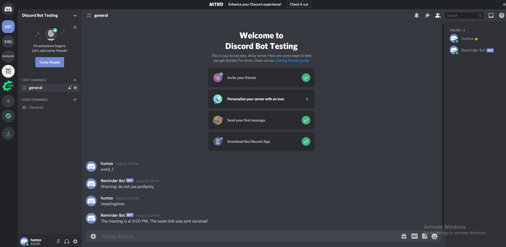

# Discord Bot
This discord bot was written using python and the discord.py library. The bot sends meeting information if the user uses a certain command. There is also a profanity filter implemented using a list of banned words and a for loop. The bot checks each message by looping through the list and sending a warning message if there is any profanity.

